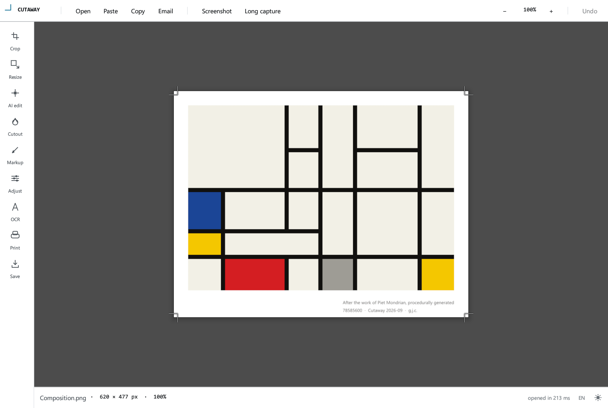
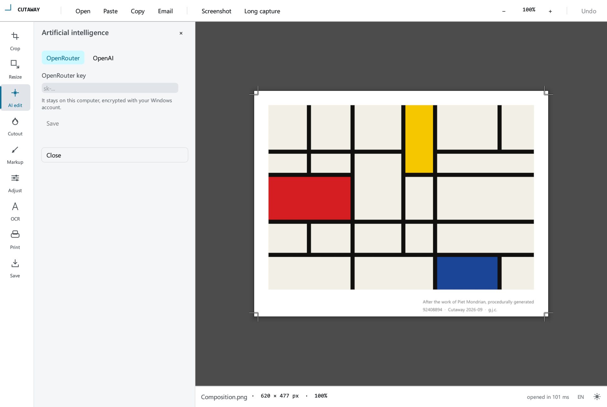
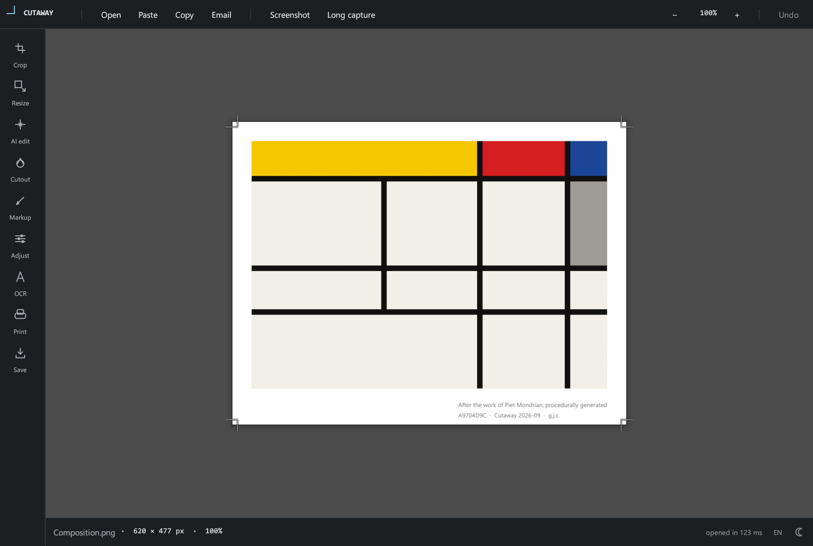
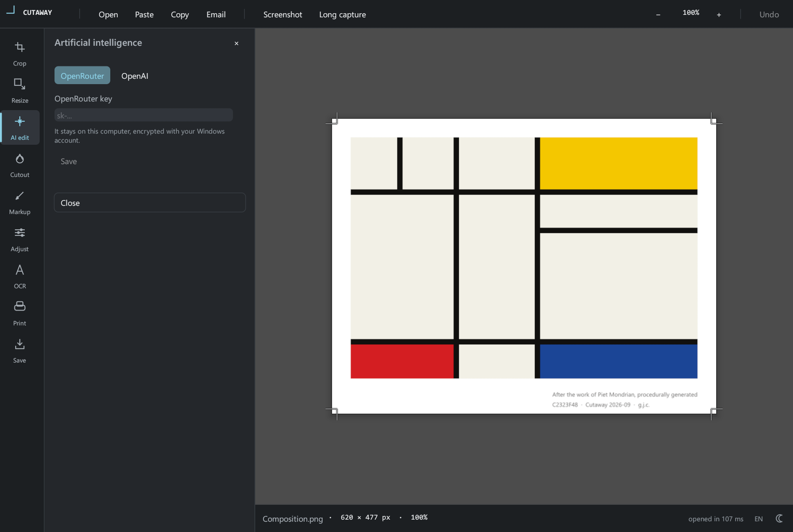
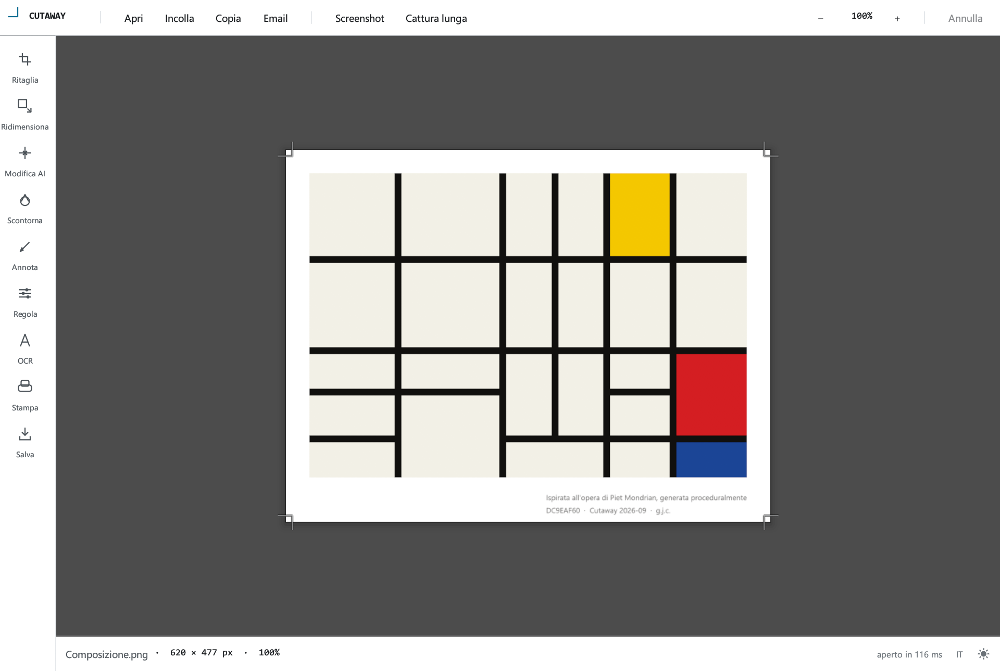
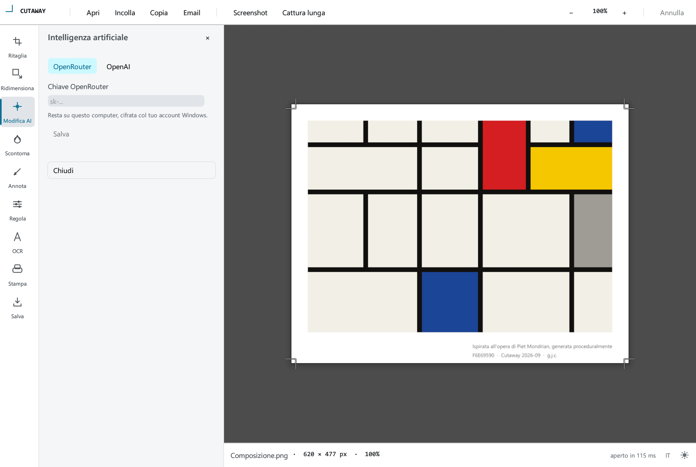
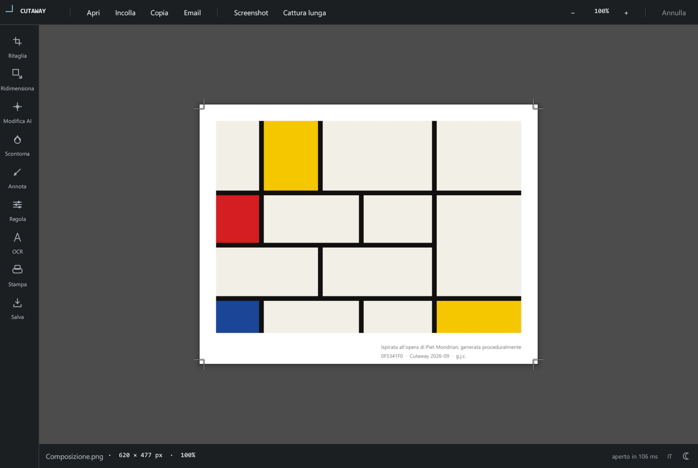
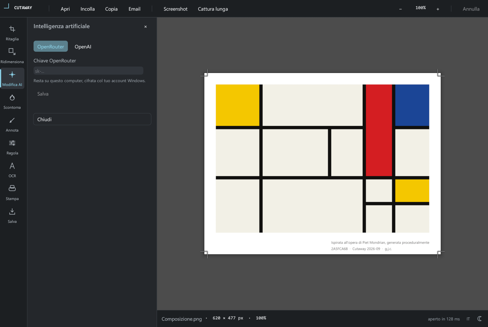

# Cutaway

**Everything a picture needs before you send it.**

> 🇮🇹 Anche **[in italiano](#cutaway-italiano)**.

A small image editor for Windows: take a screenshot, crop, convert, key out a
background, adjust the tone, read the text in it, annotate, print, email. One
window, about a tenth of a second to start, nothing to install and nothing to
configure.

**Press `Ctrl+PrtSc` in any program** and the screen freezes and dims. Drag a
rectangle over what you want, let go, and it opens here ready to edit.
`AltGr+PrtSc` does the same, for keyboards where it falls better under one hand.

There is AI in it for the two jobs honest arithmetic on pixels cannot do —
repaint a picture from a description, and enlarge one past what the file
contains. It runs on a key you bring yourself. Nothing is resold, nothing is
bundled, and the app never owns a key of its own.

## How it looks

| Start | AI edit |
|---|---|
|  |  |
|  |  |

Light, dark, or whatever Windows is set to — the button at the right of the
status bar, next to the language.

The picture it opens with is drawn, not loaded: a composition after Mondrian,
different on every run, and a fair subject to try the tools on.

## Install

Two downloads on the [Releases][releases] page, the same application:

| | |
|---|---|
| **`Cutaway-Setup.exe`** | Installer, 4.7 MB. Per-user, no elevation — Start menu entry, uninstaller, and a tick box that makes Cutaway an option for the image formats it reads. |
| **`Cutaway-portable.zip`** | Portable, 3.6 MB. Unzip it anywhere and run `Cutaway.exe`. |

**Requires Windows 10 or 11, and nothing else.** Two executables that import no
DLL Windows does not already have: no runtime, no framework, no redistributable.

Everything written outside the program sits in `%LOCALAPPDATA%\Cutaway`: the
theme, the language, the API key if you set one, and the small program that
watches for the shortcut while Cutaway is closed.

That small program starts with Windows, so the shortcut works from the moment
you log in. Its icon next to the clock offers:

| | |
|---|---|
| **Cut a piece of the screen** | the same as the shortcut |
| **Open Cutaway** | the editor, with nothing in it |
| **Start with Windows** | on unless you turn it off |
| **Where Cutaway is…** | point it at `Cutaway.exe` if you have moved the folder |
| **About Cutaway** | version, licence, source |
| **Remove Cutaway from this computer** | on the portable: clears the shortcut, the background program and the folder in your profile, leaving your settings and your key. The installed copy has an uninstaller instead |

## What it does

| | |
|---|---|
| **Open** | PNG, JPEG, WebP, TIFF, BMP, GIF. Drop a file on the window, or start from the last folder it remembers. EXIF rotation applied on load, so a phone photo is the right way up |
| **Screenshot** | `Ctrl+PrtSc` from anywhere, or `Screenshot` in the window: the screen freezes and dims, and the rectangle you drag opens in Cutaway |
| **Long capture** | A page taller than the screen, scrolled and stitched into one picture. Point at the window, and it stops when the page stops moving or when you press `Esc` |
| **Clipboard** | Paste a bitmap or a file copied in Explorer; copy back out in two formats at once, so old programs and new ones both get their best |
| **Crop** | Eight handles, rule-of-thirds guides, and a ratio that can be fixed |
| **Cut out** | Eyedropper, tolerance, and a softened edge so antialiased artwork keeps no fringe |
| **Adjust** | Brightness, contrast, gamma, saturation, black and white, previewed live at full resolution |
| **Annotate** | Rectangle, ellipse, arrow, line, text, numbered badges, highlighter, eraser. Every mark stays editable after it is put down: click it to pick it up, drag it, change its colour and thickness, or delete it |
| **OCR** | The text in the picture, read by Windows' own engine, in the languages the machine has installed. Copy it out as one block |
| **Resize** | Lanczos, proportions kept, resulting file size measured before you commit |
| **Save as** | PNG, JPEG, WebP, PDF, TIFF, BMP, with the file size measured as you move the quality slider |
| **Print** | Composed at 300 DPI onto A3/A4/A5/Letter/Legal and opened in your PDF viewer |
| **Email** | Attached to your mail client, with an optional resize and an optional PDF |
| **AI edit** | Describe a change and let a model make it, on your own key |
| **AI upscale** | Redraw the same picture larger, without repainting the scene around it |

English and Italian, following the Windows display language unless you pick one.
Every button says what it does when you rest on it.

### Shortcuts

| Keys | Action |
|---|---|
| `Ctrl+O` / `Ctrl+S` / `Ctrl+P` | open · save as · print |
| `Ctrl+Shift+S` | cut a piece out of the screen |
| `Ctrl+PrtSc` · `AltGr+PrtSc` | the same, from any program, without opening Cutaway first |
| `Ctrl+C` / `Ctrl+V` | copy · paste |
| `Ctrl+Z` | undo |
| `Enter` / `Esc` / `Del` | apply · put the tool down · delete the selected mark |

Wheel to zoom, wheel held down to pan.

The two screen shortcuts are watched by the small program in the notification
area, which is why they work with Cutaway closed. Two limits are worth knowing.
They do nothing while a window running as administrator has the focus — Task
Manager, say — because Windows will not pass a shortcut to a program with fewer
rights than the window in front. And every capture opens its own window, so five
captures leave five windows.

## The AI models are chosen on numbers

The shortlist of six is **derived, not hand-picked**: quality from LMArena's
image-*editing* arena, price and availability from OpenRouter's image catalogue.
Three models are chosen on the lower bound of their rating interval — which
rewards being both well rated and well established — and three on price among
those still within reach of the best. A button in the dialog re-runs the
derivation and records the date it last succeeded.

Your own edits keep it honest: every edit records what the provider charged and
how long it took, and the dialog shows the median of the recent ones. A price
list can go stale; a measurement taken by using the model cannot.

The full derivation, its two sources and where it is weak:
**[RANKING_ALGO.md](RANKING_ALGO.md)**.

## Privacy

**Nothing is sent to me, or to anyone, unless you use the AI.** No telemetry, no
analytics, no update check, no crash reports, no account. The program has no
server and I have no way of knowing you are running it.

Closed, it makes **no network request at all**. Three things open one, and only
those three:

| | Goes to | What is sent |
|---|---|---|
| **AI edit** and **AI upscale** | the provider you chose — `openrouter.ai` or `api.openai.com` | the picture, your instruction, and your API key. Nothing else |
| **Update the model list** (the button in the AI panel) | `openrouter.ai` and the arena's public dataset on `datasets-server.huggingface.co` | nothing of yours: two catalogues are read |

The picture is scaled down to 2048 px on its longest side before it goes,
because that is what the models take. To OpenRouter the request also carries the
address of this repository, as attribution — that names the project, not you.

Everything else stays on the machine. The text OCR reads comes out of Windows'
own engine, on your computer. Email hands the message to your mail client
through MAPI and you press send. Screen captures are written to
`%LOCALAPPDATA%\Cutaway\captures` and deleted as soon as the editor has read
them. Your API key is encrypted with DPAPI, tied to your Windows account, and
never leaves except as the `Authorization` header of the two calls above.

## What it will not do

**Overwrite the file you opened.** There is no "Save", only "Save as", and the
dialog suggests `<name>-edited`.

**Send an email on its own.** MAPI opens your mail client with the message ready
and you press send. There are no credentials to configure and no code path that
could send without you.

**Hand your API key back to anything.** Keys are encrypted with DPAPI, tied to
your Windows account. The interface only ever learns whether a key exists.

**Photograph a moving screen.** The screen is frozen the instant you press the
shortcut and the rectangle is dragged over that still, so nothing moves under
your hand while you aim.

## What it is made of

Up to version 1.6 this was a Python program drawing a Svelte interface inside a
WebView2 window, with a C# agent behind the shortcut. It was ported whole to
Rust, and the reason is in the measurements:

| | 1.6 | 2.0 |
|---|---|---|
| launch to a usable window | 2,576 ms | **120 ms** — 21× |
| memory held | 437 MB | **53 MB** — 8× |
| what has to be installed | WebView2 runtime, .NET Framework 4.8 | **nothing** |
| adjusting a 4.1-megapixel photograph | on a preview capped at 2000 px | **38 ms at full resolution** |

Two executables now, both Rust, nothing between them and Windows.

**`Cutaway.exe`** — the window. [egui](https://github.com/emilk/egui) through
`eframe`, drawn with **Glow**, which is OpenGL. The same window was built on
wgpu to compare: **102 ms from launch to a drawn frame against wgpu's 659**, on
the same picture and the same machine, and half the executable. For a program that has to appear the instant a rectangle is
released, that is the whole argument.
`image` for the codecs, `ab_glyph` to put text into pixels, `rfd` for the file
dialogs so they are the system's own, `ureq` over `rustls` for the two AI calls,
`windows-sys` for Win32 and `windows` for the one WinRT thing it needs — the OCR
engine.

**`CutawayAgent.exe`** — the shortcut. Win32 and nothing else: `RegisterHotKey`,
a layered window over the frozen screen, `BitBlt`, an icon in the notification
area. 509 KB.

Both link their C runtime in, so neither asks the machine for anything. The
interface is drawn rather than assembled: every icon in it is a few line
segments in code, so there is no image to load, no licence to carry and nothing
that goes blurry on a display it was not made for.

## Building it

Two crates, both Rust, both MSVC. `rustup` and the Visual Studio Build Tools are
the whole toolchain.

```powershell
cd editor-rs; cargo build --release   # Cutaway.exe, the window
cd agent-rs;  cargo build --release   # CutawayAgent.exe, the shortcut

node tools/build-2.0.mjs              # both, then the zip and the installer
```

The build script checks the two things that have gone wrong: that the crates
declare the same version, and that neither executable imports the Visual C++
redistributable — the C runtime is linked in, which is what makes the packages
need nothing installed.

The installer is [Inno Setup 6](https://jrsoftware.org/isinfo.php)
(`winget install -e --id JRSoftware.InnoSetup --scope user`).

The interface is set in Segoe UI and Consolas, read from Windows at run time: no
Microsoft font is embedded or shipped. Behind them sit the faces egui carries,
which are compiled in — see [NOTICE](NOTICE) — and take over on a machine
missing the Windows ones.

## Checks

```powershell
cd editor-rs; cargo test              # 129 tests
cd agent-rs;  cargo test              # 3

powershell -File tools\shots.ps1      # the eight screenshots above, retaken
```

And the packages, each on a clean Windows:

```powershell
powershell -File tools\sandbox\run.ps1 -Mode installed
powershell -File tools\sandbox\run.ps1 -Mode portable
```

Each opens a Windows Sandbox, installs or unzips, checks the files and the
registry, draws the window, presses the shortcut for real and drags a rectangle,
opens the agent's dialogs, then removes everything and checks that nothing was
left behind — and closes the sandbox. The report and the pictures land in
`dist/prove`. Windows runs one sandbox at a time, so they go one after the other.

## Licence

[Apache 2.0](LICENSE). Use, modify and redistribute it, including commercially,
provided the copyright and attribution notices are kept — see [NOTICE](NOTICE).
Derivative works must credit the original author and state that they changed it.

Created by **Giovanni J. Costantini** — [costantini.pw](https://costantini.pw)

[releases]: https://github.com/GiovanniCst/Cutaway/releases

<br>

---
---

<br>

# Cutaway (italiano)

**Tutto quello che serve a un'immagine prima di mandarla.**

> 🇬🇧 Also **[in English](#cutaway)**.

Un piccolo editor di immagini per Windows: ritaglia lo schermo, taglia,
converte, scontorna, regola il tono, legge il testo che c'è dentro, annota,
stampa, spedisce. Una finestra sola, un decimo di secondo per aprirsi, niente da
installare e niente da configurare.

**Premi `Ctrl+Stamp` in qualsiasi programma** e lo schermo si congela e si
scurisce. Traccia un rettangolo su quello che ti serve, lascia, e si apre qui
pronto da modificare. `AltGr+Stamp` fa lo stesso, per le tastiere dove cade
meglio sotto una mano sola.

C'è dell'AI, per le due cose che l'aritmetica onesta sui pixel non sa fare:
ridipingere un'immagine a partire da una descrizione, e ingrandirla oltre quello
che il file contiene. Funziona con una chiave che porti tu. Niente viene
rivenduto, niente è incluso, e l'app non possiede mai una chiave propria.

## Che aspetto ha

| Avvio | Modifica AI |
|---|---|
|  |  |
|  |  |

Chiaro, scuro, o quello che dice Windows — il pulsante a destra nella barra di
stato, accanto alla lingua.

L'immagine con cui si apre è disegnata, non caricata: una composizione ispirata
a Mondrian, diversa a ogni avvio, e un buon soggetto su cui provare gli
strumenti.

## Installazione

Due file nella pagina delle [Release][releases], stessa applicazione:

| | |
|---|---|
| **`Cutaway-Setup.exe`** | Installazione, 4,7 MB. Per utente, senza elevazione — voce nel menu Start, disinstallazione, e una casella che rende Cutaway una scelta per i formati immagine che legge. |
| **`Cutaway-portable.zip`** | Portabile, 3,6 MB. Scompattalo dove vuoi e avvia `Cutaway.exe`. |

**Serve Windows 10 o 11, e nient'altro.** Due eseguibili che non chiamano nessuna
DLL che Windows non abbia già: nessun runtime, nessun framework, nessun
redistributable.

Tutto quello che viene scritto fuori dal programma sta in
`%LOCALAPPDATA%\Cutaway`: il tema, la lingua, la chiave API se ne imposti una, e
il programmino che sorveglia la scorciatoia mentre Cutaway è chiuso.

Quel programmino parte con Windows, così la scorciatoia funziona dal momento in
cui accedi. La sua icona vicino all'orologio offre:

| | |
|---|---|
| **Ritaglia lo schermo** | come la scorciatoia |
| **Apri Cutaway** | l'editor, vuoto |
| **Avvia con Windows** | attivo finché non lo togli |
| **Dove si trova Cutaway…** | indicagli `Cutaway.exe` se hai spostato la cartella |
| **Informazioni su Cutaway** | versione, licenza, sorgenti |
| **Rimuovi Cutaway da questo computer** | sulla portabile: toglie la scorciatoia, il programma in secondo piano e la cartella nel tuo profilo, lasciando le impostazioni e la chiave. La copia installata ha la sua disinstallazione |

## Cosa fa

| | |
|---|---|
| **Apri** | PNG, JPEG, WebP, TIFF, BMP, GIF. Trascina un file sulla finestra, o riparti dall'ultima cartella che ricorda. Rotazione EXIF applicata all'apertura, così la foto del telefono sta per il verso giusto |
| **Screenshot** | `Ctrl+Stamp` da ovunque, o `Screenshot` nella finestra: lo schermo si congela e si scurisce, e il rettangolo che tracci si apre in Cutaway |
| **Cattura lunga** | Una pagina più alta dello schermo, scorsa e ricucita in un'immagine sola. Indica la finestra, e si ferma quando la pagina smette di muoversi o quando premi `Esc` |
| **Appunti** | Incolla una bitmap o un file copiato in Esplora risorse; ricopia fuori in due formati insieme, così i programmi vecchi e quelli nuovi prendono ognuno il suo |
| **Ritaglia** | Otto maniglie, guide dei terzi, e una proporzione che si può bloccare |
| **Scontorna** | Contagocce, tolleranza, e un bordo ammorbidito perché la grafica antialiasata non conservi un alone |
| **Regola** | Luminosità, contrasto, gamma, saturazione, bianco e nero, in anteprima dal vivo a piena risoluzione |
| **Annota** | Rettangolo, ellisse, freccia, linea, testo, numeretti, evidenziatore, gomma. Ogni segno resta modificabile dopo essere stato posato: cliccalo per riprenderlo, spostalo, cambiagli colore e spessore, o cancellalo |
| **OCR** | Il testo dentro l'immagine, letto dal motore di Windows, nelle lingue installate sulla macchina. Si copia fuori in un blocco solo |
| **Ridimensiona** | Lanczos, proporzioni mantenute, peso del file misurato prima di confermare |
| **Salva con nome** | PNG, JPEG, WebP, PDF, TIFF, BMP, con il peso del file misurato mentre muovi il cursore della qualità |
| **Stampa** | Composta a 300 DPI su A3/A4/A5/Letter/Legal e aperta nel tuo lettore PDF |
| **Email** | Allegata al tuo programma di posta, con un ridimensionamento opzionale e un PDF opzionale |
| **Modifica AI** | Descrivi un cambiamento e lascialo fare a un modello, sulla tua chiave |
| **Ingrandimento AI** | Ridisegna la stessa immagine più grande, senza ridipingere la scena intorno |

Italiano e inglese, seguendo la lingua di Windows a meno che non ne scegli una.
Ogni pulsante dice cosa fa quando ci passi sopra.

### Scorciatoie

| Tasti | Azione |
|---|---|
| `Ctrl+O` / `Ctrl+S` / `Ctrl+P` | apri · salva con nome · stampa |
| `Ctrl+Maiusc+S` | ritaglia un pezzo di schermo |
| `Ctrl+Stamp` · `AltGr+Stamp` | lo stesso, da qualsiasi programma, senza aprire prima Cutaway |
| `Ctrl+C` / `Ctrl+V` | copia · incolla |
| `Ctrl+Z` | annulla |
| `Invio` / `Esc` / `Canc` | applica · posa lo strumento · elimina il segno selezionato |

Rotella per lo zoom, rotella premuta per spostare.

Le due scorciatoie dello schermo le sorveglia il programmino vicino
all'orologio, ed è per questo che funzionano a Cutaway chiuso. Due limiti vanno
saputi. Non fanno niente mentre ha il fuoco una finestra che gira come
amministratore — il Gestione attività, per dire — perché Windows non passa una
scorciatoia a un programma con meno diritti della finestra davanti. E ogni
cattura apre una finestra nuova, quindi cinque catture lasciano cinque finestre.

## I modelli AI sono scelti sui numeri

La rosa di sei è **derivata, non scelta a mano**: la qualità dall'arena LMArena
di *editing* di immagini, prezzo e disponibilità dal catalogo immagini di
OpenRouter. Tre modelli si scelgono sul limite inferiore dell'intervallo di
valutazione — che premia l'essere insieme ben valutati e ben collaudati — e tre
sul prezzo fra quelli ancora a portata dei migliori. Un pulsante nella finestra
rifà la derivazione e registra la data dell'ultima riuscita.

Le tue modifiche la tengono onesta: ogni modifica registra quanto ha chiesto il
fornitore e quanto ci ha messo, e la finestra mostra la mediana delle recenti.
Un listino può invecchiare; una misura presa usando il modello no.

La derivazione completa, le sue due fonti e dove è debole:
**[RANKING_ALGO.md](RANKING_ALGO.md)**.

## Privacy

**Non viene mandato niente a me, né a nessun altro, a meno che tu non usi l'AI.**
Nessuna telemetria, nessuna analitica, nessun controllo di aggiornamenti, nessun
rapporto di errore, nessun account. Il programma non ha un server e non ho modo
di sapere che lo stai usando.

Chiuso, **non fa nessuna richiesta di rete**. Tre cose ne aprono una, e solo
quelle:

| | Va a | Cosa esce |
|---|---|---|
| **Modifica AI** e **Ingrandimento AI** | il fornitore che hai scelto — `openrouter.ai` o `api.openai.com` | l'immagine, la tua istruzione e la tua chiave API. Nient'altro |
| **Aggiorna l'elenco dei modelli** (il pulsante nel pannello AI) | `openrouter.ai` e il dataset pubblico dell'arena su `datasets-server.huggingface.co` | niente di tuo: si leggono due cataloghi |

L'immagine viene ridotta a 2048 px sul lato lungo prima di partire, perché è
quello che i modelli accettano. Verso OpenRouter la richiesta porta anche
l'indirizzo di questo repository, come attribuzione — nomina il progetto, non te.

Tutto il resto resta sulla macchina. Il testo che l'OCR legge esce dal motore di
Windows, sul tuo computer. L'email consegna il messaggio al tuo programma di
posta via MAPI e Invia lo premi tu. I ritagli dello schermo si scrivono in
`%LOCALAPPDATA%\Cutaway\captures` e si cancellano appena l'editor li ha letti.
La tua chiave API è cifrata con DPAPI, legata al tuo account Windows, e non esce
se non come header `Authorization` delle due chiamate qui sopra.

## Cosa non fa

**Sovrascrivere il file che hai aperto.** Non c'è "Salva", solo "Salva con
nome", e la finestra propone `<nome>-edited`.

**Mandare un'email da sola.** MAPI apre il tuo programma di posta con il
messaggio pronto e Invia lo premi tu. Non ci sono credenziali da configurare e
non c'è una strada nel codice che possa spedire senza di te.

**Restituire la tua chiave API a qualcosa.** Le chiavi sono cifrate con DPAPI,
legate al tuo account Windows. L'interfaccia sa soltanto se una chiave esiste.

**Fotografare uno schermo in movimento.** Lo schermo si congela nell'istante in
cui premi la scorciatoia e il rettangolo si traccia su quella fotografia, così
niente si muove sotto la mano mentre miri.

## Di cosa è fatto

Fino alla 1.6 questo era un programma Python che disegnava un'interfaccia Svelte
dentro una finestra WebView2, con un agente C# dietro la scorciatoia. È stato
portato interamente su Rust, e il motivo sta nelle misure:

| | 1.6 | 2.0 |
|---|---|---|
| dall'avvio a una finestra usabile | 2.576 ms | **120 ms** — 21× |
| memoria occupata | 437 MB | **53 MB** — 8× |
| cosa bisogna installare | runtime WebView2, .NET Framework 4.8 | **niente** |
| regolare una foto da 4,1 megapixel | su un'anteprima ridotta a 2000 px | **38 ms a piena risoluzione** |

Adesso due eseguibili, tutti e due Rust, niente fra loro e Windows.

**`Cutaway.exe`** — la finestra. [egui](https://github.com/emilk/egui) tramite
`eframe`, disegnata con **Glow**, cioè OpenGL. La stessa finestra è stata
costruita anche su wgpu per confronto: **102 ms dall'avvio a un fotogramma
disegnato contro i 659 di wgpu**, sulla stessa immagine e la stessa macchina, e
metà dell'eseguibile. Per un programma che
deve comparire nell'istante in cui lasci il rettangolo, l'argomento è tutto lì. `image` per i codec, `ab_glyph` per mettere il testo nei pixel, `rfd` per
le finestre di file, così sono quelle di sistema, `ureq` su `rustls` per le due
chiamate AI, `windows-sys` per il Win32 e `windows` per l'unica cosa WinRT che
serve: il motore OCR.

**`CutawayAgent.exe`** — la scorciatoia. Win32 e nient'altro: `RegisterHotKey`,
una finestra a livelli sopra lo schermo congelato, `BitBlt`, un'icona vicino
all'orologio. 509 KB.

Tutti e due compilano dentro la propria runtime C, quindi nessuno dei due chiede
niente alla macchina. L'interfaccia è disegnata, non assemblata: ogni icona è
qualche segmento di retta nel codice, quindi non c'è un'immagine da caricare, non
c'è una licenza da portarsi dietro e non c'è niente che sgrani su uno schermo per
cui non era stato fatto.

## Compilarlo

Due crate, tutti e due Rust, tutti e due MSVC. `rustup` e i Visual Studio Build
Tools sono l'intero necessario.

```powershell
cd editor-rs; cargo build --release   # Cutaway.exe, la finestra
cd agent-rs;  cargo build --release   # CutawayAgent.exe, la scorciatoia

node tools/build-2.0.mjs              # tutti e due, poi lo zip e l'installer
```

Lo script di build controlla le due cose che sono andate storte: che i crate
dichiarino la stessa versione, e che nessuno dei due eseguibili chiami il
redistributable Visual C++ — la runtime C è compilata dentro, ed è questo che
rende i pacchetti indipendenti da qualsiasi installazione.

L'installer è [Inno Setup 6](https://jrsoftware.org/isinfo.php)
(`winget install -e --id JRSoftware.InnoSetup --scope user`).

L'interfaccia è composta in Segoe UI e Consolas, letti da Windows a runtime:
nessun font Microsoft è incluso o distribuito. Dietro ci sono i caratteri che
egui si porta, che invece sono compilati dentro — vedi [NOTICE](NOTICE) — e
subentrano su una macchina che non avesse quelli di Windows.

## Verifiche

```powershell
cd editor-rs; cargo test              # 129 test
cd agent-rs;  cargo test              # 3

powershell -File tools\shots.ps1      # gli otto screenshot qui sopra, rifatti
```

E i pacchetti, ognuno su un Windows pulito:

```powershell
powershell -File tools\sandbox\run.ps1 -Mode installed
powershell -File tools\sandbox\run.ps1 -Mode portable
```

Ognuno apre una Windows Sandbox, installa o scompatta, controlla i file e il
registro, disegna la finestra, preme la scorciatoia sul serio e traccia un
rettangolo, apre le finestre dell'agente, poi toglie tutto e verifica che non
sia rimasto niente — e chiude la sandbox. Il referto e le immagini finiscono in
`dist/prove`. Windows tiene aperta una sandbox alla volta, quindi vanno una
dopo l'altra.

## Licenza

[Apache 2.0](LICENSE). Puoi usarlo, modificarlo e ridistribuirlo, anche
commercialmente, purché restino le note di copyright e attribuzione — vedi
[NOTICE](NOTICE). Le opere derivate devono citare l'autore originale e
dichiarare di averlo modificato.

Creato da **Giovanni J. Costantini** — [costantini.pw](https://costantini.pw)
